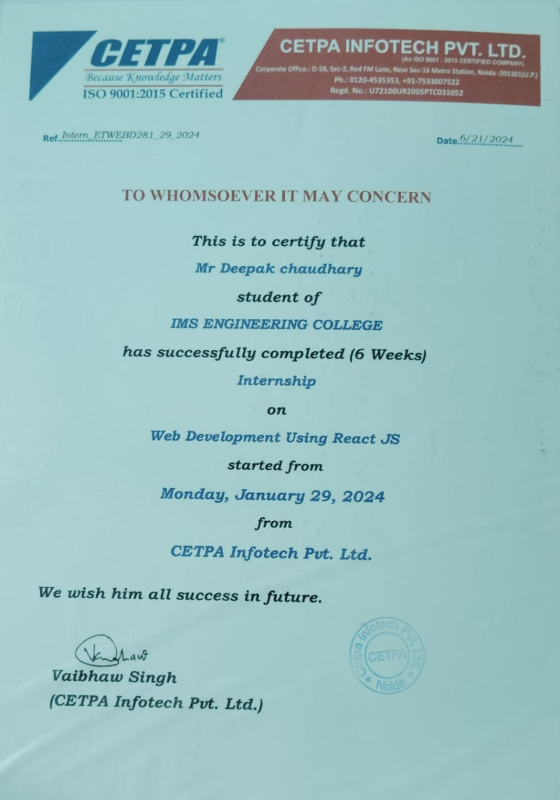
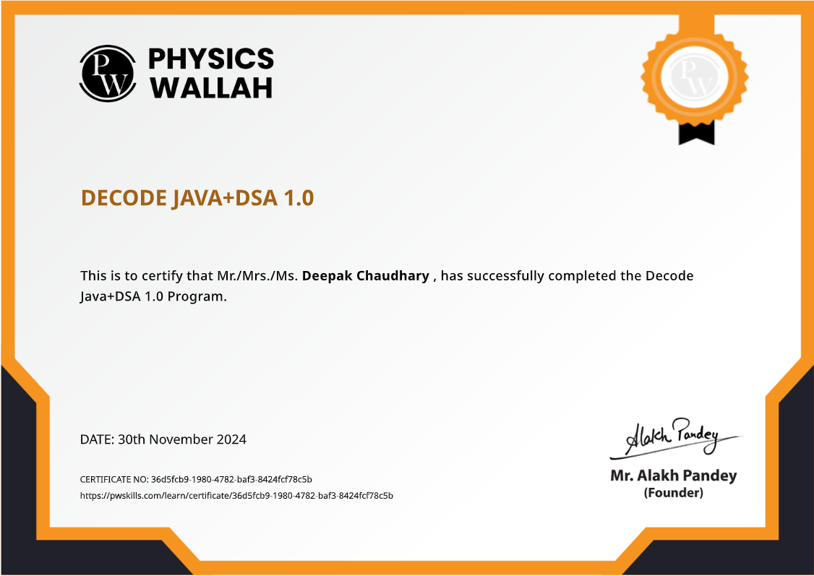

# 🏆 My Certificates

Welcome to my certificates collection!  
Here you can find all the certifications and achievements I have earned.

---

## 📜 Certificates

### 💻 Web Development Internship (React JS)
- **Issued by:** CETPA Infotech Pvt. Ltd.
- **Duration:** 6 Weeks  
- **College:** IMS Engineering College  
- **Skills:** React JS, Web Development  
- **Description:** Successfully completed a 6-week internship focused on React JS and modern web development practices.

👀 View Certificate

  

---

### 🧘 Har Ghar Dhyan Session
- **Issued by:** Ministry of Culture, Government of India  
- **Organized by:** The Art of Living  
- **Skills:** Meditation, Mindfulness  
- **Description:** Participated in a nationwide meditation initiative to promote mental wellness and mindfulness.

👀 View Certificate

  

---

### 📱 Android Development
- **Issued by:** RINEX  
- **Skills:** Android, Mobile App Development  
- **Description:** Learned fundamentals of Android app development including UI design, activities, and application lifecycle.

👀 View Certificate

  
  

---

### 🛠️ Backend Development
- **Issued by:** Physics wallah  
- **Skills:** Node.js, APIs, Databases  
- **Description:** Gained knowledge of backend systems, REST APIs, server-side logic, and database integration.

👀 View Certificate

  

---

### 🚀 BE10X Program
- **Issued by:** BE10X  
- **Skills:** Productivity, Tech Tools  
- **Description:** Completed BE10X program focusing on modern tools, productivity enhancement, and industry skills.

👀 View Certificate

  

---

### 🌐 HTML & CSS
- **Issued by:** EDUCBA  
- **Skills:** HTML, CSS, Responsive Design  
- **Description:** Built strong foundation in web design, layouts, styling, and responsive user interfaces.

👀 View Certificate

  

---

### ☕ Java Programming
- **Issued by:** C#corner  
- **Skills:** Java, OOP  
- **Description:** Learned core Java programming concepts including OOP, exception handling, and application logic.

👀 View Certificate

  

---

### 🧠 Java & DSA
- **Issued by:** Physics wallah  
- **Skills:** Java, Data Structures, Algorithms  
- **Description:** Strengthened problem-solving skills using data structures and algorithms with Java.

👀 View Certificate

  

---

### ♻️ Renewable Energy
- **Issued by:** udemy  
- **Skills:** Sustainability, Energy Systems  
- **Description:** Gained knowledge of renewable energy sources and sustainable development practices.

👀 View Certificate

  

---

### 💼 Internship Letter
- **Issued by:** SO infotech (P) LTD  
- **Skills:** Professional Experience  
- **Description:** Received official internship completion letter recognizing practical experience and contribution.

👀 View Certificate

  

---

### 🏢 OctaNet Services Pvt. Ltd.
- **Issued by:** OctaNet Services Pvt. Ltd.  
- **Skills:** Industry Training  
- **Description:** Completed certification/internship demonstrating practical exposure to real-world development tasks.

👀 View Certificate

  

---

## 👨‍💻 About Me
- 🎓 B.Tech Student (IMS Engineering College, Ghaziabad)
- 💻 Full Stack Developer
